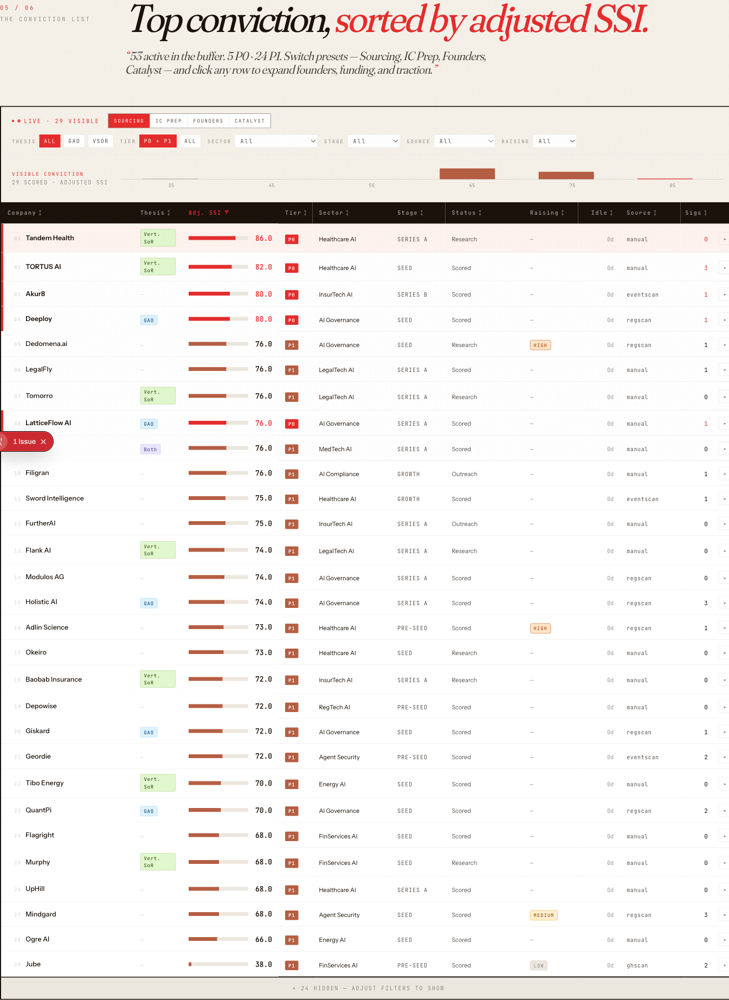

# LP-Live-Deck

A live, public LP pitch deck for **Signals Over Stories** — Sevda Anefi's
European early-stage AI venture thesis. The page *is* the pitch: Notion
databases flow through Next.js ISR into an editorial-magazine layout, so every
company logged or signal recorded re-renders the site within a minute.

**Live → https://lp-live-deck.vercel.app**



## How it works

Notion data sources → typed fetchers (`src/lib/notion.ts`) → one ISR
orchestrator (`src/app/page.tsx`, `revalidate = 60`) → six narrative sections.
The deck keeps no database of its own — the Notion workspace is the source of
truth, and the site is its public render.

- **Stack** — Next.js 15 (App Router, React Server Components), React 19,
  Tailwind v4 (CSS-first `@theme`), Motion, Recharts, `@notionhq/client` v5.
- **Data** — four Notion data sources: Companies, Signals, a Thesis Pack page,
  and Writing. Every fetcher degrades to a typed empty state and never throws,
  so a Notion outage softens a section rather than breaking the page.
- **Evidence table** — a Harmonic/PitchBook-shaped dense table: sortable
  columns, four view presets, inline-expand rows, and a live conviction
  histogram that re-animates as the filters change.

## Commands

```bash
npm install
npm run dev          # http://localhost:3000
npm run build        # production build
npm run type-check   # tsc --noEmit — run before every commit
npm run lint         # eslint . (ESLint 9 flat config)
```

## Deploy

Pushing to `main` auto-deploys to production via the Vercel GitHub integration.

Architecture detail, the full Notion data model, and contributor conventions
live in [`CLAUDE.md`](./CLAUDE.md).
